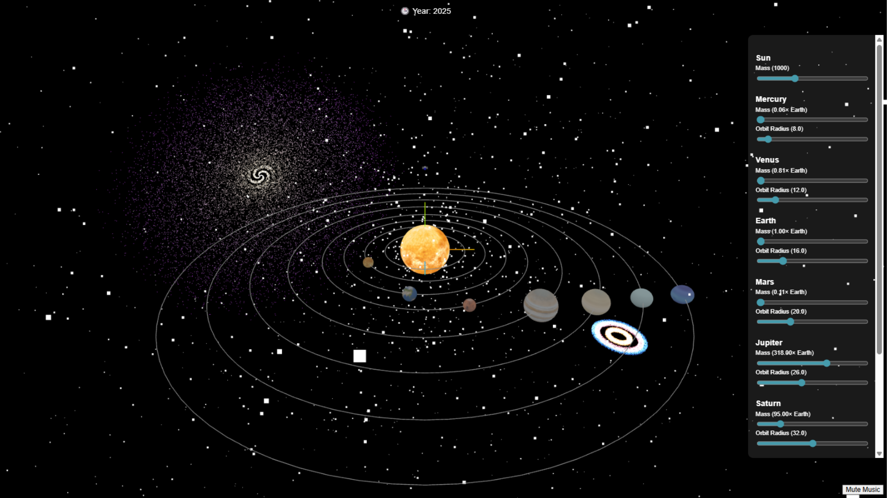
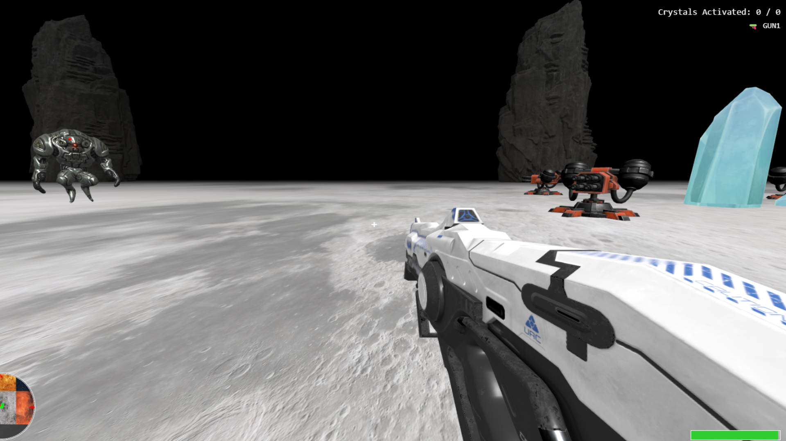
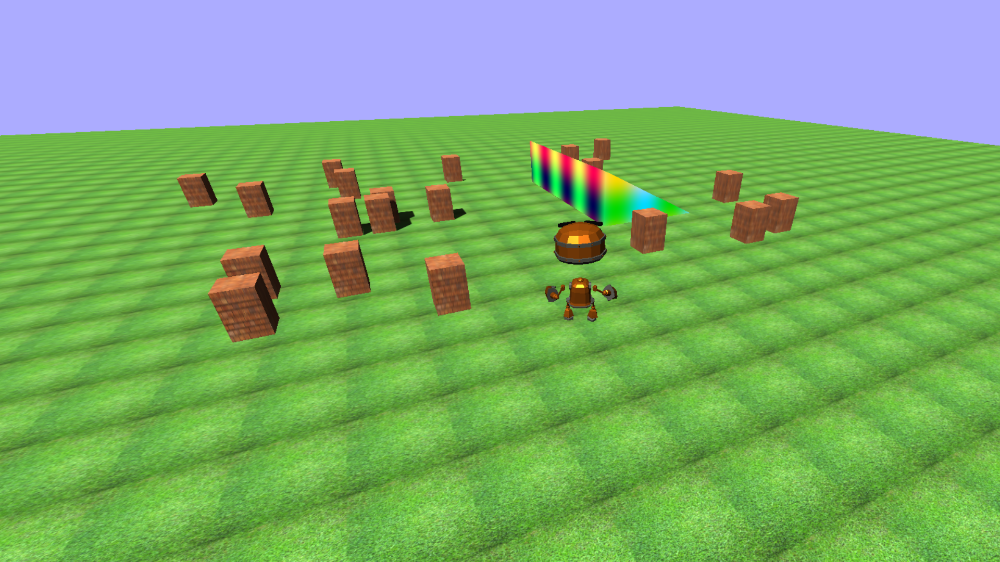

# 🌐 3D Visualizations with Three.js and WebGL

This project is a collaborative effort between three members, each focusing on a different interactive 3D application using **Three.js**, **WebGL**, and **Vite** as the development server. The project is structured as a multi-page web application, with a single landing page to navigate to each module.

## 🚀 Live Overview

- **Landing Page:** A central hub to access each demo.
- **Vite:** Fast local development server with module support.
- **Three.js:** Used in all 3D applications for rendering and animation.

---

## 🧑‍🤝‍🧑 Team Contributions

| Member | Project Focus | Folder |
|--------|----------------|--------|
| Member 1 | 📘 Conformal mapping with complex analysis | `conformal-mapping/` |
| Member 2 | 📦 3D visualization with block movement (like game interaction) | `3d-visualization/` |
| Member 3 | 🏀 3D projectile simulation and animation | `projectile-motion/` |

---

## 📁 Project Structure

📦 Member 2: 3D Visualization
This module features a set of interactive 3D experiences built using Three.js, simulating basic game mechanics and physics-driven environments. It focuses on user control, object interaction, and scene transitions in real time.

| Demo                       | Description                                                 |
| -------------------------- | ----------------------------------------------------------- |
| **Galaxy Simulation**      | Real-time rotating galaxy visualization using particles.    |
| **Moonbase Defender Game** | A mini first-person shooting game on a moon-like terrain.   |
| **3D Cube Simulation**     | First-person cube controller with pointer lock and jumping. |
| **Car Simulation**         | A simple driving demo using keyboard controls.              |
| **Robot Model**            | 3D animated robot walking in a textured environment.        |
| **Mrble Ball Game**        | A casual physics-based ball game with user interaction.     |
 
### 🌟 Preview Screenshots

|  |  |
|:--:|:--:|
| **Galaxy Simulation** | **Marble Game** |

|  |  |
|:--:|:--:|
| **Moonbase Defender** | **Robot Model** |

📚 Libraries & Tools Used:
Three.js: Core 3D rendering engine

GLTFLoader: Load .glb/.gltf models

PointerLockControls: For immersive first-person controls

OrbitControls: Used in some scenes for mouse orbit interaction

Vite: Fast dev server and module bundler

cannon-es: For basic physics 

GSAP: For smooth animations and transitions 
